# 프론트 사양표 기반 DB · API 설계

작성일: 2026-09-21 · 상태: 구현 전 설계 초안

현재 화면에 맞춰 **한국 시장 스마트폰 모델을 1~3개 조회·비교하는 공개 카탈로그**를 설계한다. PostgreSQL 16, Rust/Axum, SQLx, utoipa를 유지한다. 모델·식별자·용량별 구성·출처는 관계형 테이블에, 형태가 다른 27개 사양은 고정된 키와 타입을 갖는 JSONB 값으로 저장한다.

산출물은 [SQL 초안](catalog-schema.sql)과 [OpenAPI 3.1 계약](catalog-openapi.yaml)이다. SQL은 `migrations/` 밖에 있으며 실행하지 않았다. API도 아직 구현하거나 현재 Swagger에 등록하지 않았다. 기존 users/auth와 프론트 동작은 그대로다.

## 1. 화면에서 확인한 요구사항

프론트 기준 디렉터리: `../../device-lover-web/`.

| 화면·코드 | 확인한 동작 | 설계 반영 |
| --- | --- | --- |
| `data/devices.ts`의 Device·specificationSections | 19개 fixture, 6개 섹션, 33개 표시 행, 27개 실제 사양 키 | 사양은 키별 한 번 저장하고 여러 표시 행에서 재사용 |
| `device-specification-page.tsx`의 상세/비교 표 | 1개 상세, 2~3개 비교 | 조회 상한 3개, 요청 순서 유지 |
| `getSpecificationValue` | RAM+저장 옵션, 화면 크기+해상도+펜 지원 합성 | 단위 문자열 파싱을 raw 기반 formatter로 전환 |
| `DeviceHeader` | 브랜드, 이름, 별칭에서 추출한 모델 번호, 대표 구성 라벨, 이미지 | modelNumbers, 표시용 variant, 실제 configurations 분리 |
| `lib/device-search.ts` | 이름·slug·별칭 검색, 정확/접두사/부분 일치, 빈 검색은 최신순 | 검색 우선순위와 URL 식별 규칙 명세 |
| `app/[comparison]/page.tsx` | `/{identifier}-vs-{identifier}`; 별칭 해소 후 중복·없는 제품 거절 | 반복 query parameter, canonical URL, 전체 요청 검증 |
| `comparison-list-bar.tsx` | URL이 비교 목록 상태, 순서 변경·삭제 | 비교 목록 DB 테이블 불필요 |
| `app/page.tsx`, `site-header.tsx` | 최신 2개를 본문·헤더에서 각각 계산 | 홈 API의 동일 결과를 본문·선택 목록·메타데이터에 재사용 |
| 표 하단 | 제조사 출처 링크, 지역·시험 조건 안내 | 출처 URL·확인 시각·시장·조건 보존 |

프론트의 `docs/initial-architecture-options.md`는 화면 구현 전 후보 문서다. 그 문서의 **최대 4개, SKU 단위 비교, 카메라 동시 지원** 대신 현재 코드의 **최대 3개, 모델 단위, 스마트폰 우선**을 이번 설계 기준으로 삼는다. `/test/comp/*`, `/test/ui/*`는 시안이며 운영 계약은 메인 화면 기준이다.

### 모델과 구성의 의미

현재 slug는 모델을 가리킨다. 헤더의 `16GB · 1TB`와 표의 `12GB / 16GB`, `256GB · 512GB · 1TB`는 서로 다른 정보다.

- `device_models`: 한 시장의 모델. 현재는 `market_code=KR`로 제한한다.
- `summary_variant_label` → API `variant`: 기존 헤더 표시 라벨. 선택된 SKU나 모든 사양의 기준으로 해석하지 않는다.
- `device_configurations`: 공식 자료로 확인한 실제 RAM/저장 용량 조합. 확인 전에는 빈 배열이다. 모든 옵션의 조합을 임의로 생성하지 않는다.
- `memory.raw.optionsGb`, `storage.raw.optionsGb`: 모델의 알려진 옵션 목록. 특정 RAM이 특정 용량에서만 제공되면 configurations에 실제 조합을 넣고 detail에 설명한다.

색상별 판매 SKU, 가격·재고·판매처, 즐겨찾기, 저장된 비교, 관리자 UI, 카메라 카테고리는 현재 범위에서 제외한다. 다국가 지원은 모델 번호 중복과 지역별 사양을 정의한 뒤 식별자 namespace를 확장한다.

## 2. DB 구조

```mermaid
erDiagram
    brands ||--o{ device_models : owns
    device_models ||--o{ device_aliases : labels
    device_models ||--o{ device_identifiers : resolves
    device_models ||--o{ device_configurations : offers
    device_models ||--o{ device_sources : documents
    device_models ||--o{ device_spec_values : describes
    device_sources o|--o{ device_spec_values : overrides_source
    brands {
        uuid id PK
        text slug UK
        text name
    }
    device_models {
        uuid id PK
        uuid brand_id FK
        text slug UK
        text category
        text name
        text market_code
        date release_date
        text summary_variant_label
        text image_url
        text publication_status
        timestamptz verified_at
        timestamptz updated_at
    }
    device_aliases {
        uuid id PK
        uuid device_id FK
        text value
        text kind
        integer position
    }
    device_identifiers {
        text route_key PK
        uuid device_id FK
        text search_key
    }
    device_configurations {
        uuid id PK
        uuid device_id FK
        integer storage_gb
        integer ram_gb
        text ram_status
        text label
        integer position
    }
    device_sources {
        uuid id PK
        uuid device_id FK
        text url
        text title
        timestamptz checked_at
        boolean is_primary
    }
    device_spec_values {
        uuid device_id PK,FK
        text spec_key PK
        text status
        jsonb raw_value
        text display_value
        text detail
        uuid source_id FK
    }
```



| 테이블 | 역할·주요 제약 |
| --- | --- |
| brands | samsung/apple 같은 안정적인 slug와 SAMSUNG/APPLE 표시명 |
| device_models | UUID 내부 식별자, 불변 slug, 한국 출시일, 공개 상태. slug 최대 120자, `-vs-` 포함과 `-vs` 접미 금지 |
| device_aliases | 원본 별칭·모델 번호·하드웨어 식별자. kind와 position으로 종류·표시 순서 보존 |
| device_identifiers | slug·이름·별칭의 파생 조회 레지스트리. route_key 전역 유일, 같은 모델의 정규화 중복은 1행으로 합침 |
| device_configurations | 검증된 구성, RAM 미상/미공개를 0과 구분. `(device_id,storage_gb,ram_gb)`는 NULL도 같은 값으로 간주해 중복 거절 |
| device_sources | 복수 출처, 대표는 최대 1개. 사양별 다른 출처가 없으면 대표 사용 |
| device_spec_values | `(device_id,spec_key)`당 한 행. key 27개 고정. source_id+device_id 복합 FK로 다른 모델의 출처 참조 금지 |

섹션·행 순서, 한글 라벨, formatter, visual 색상 테마는 코드의 사양 레지스트리가 소유한다. 화면 배치용 DB 테이블은 만들지 않는다. 같은 memory가 두 섹션에 나타나도 DB 값은 하나다.

JSONB는 키마다 다른 객체·배열을 보존하기 위한 선택이다. 검색·출시일·브랜드 조건은 일반 컬럼으로 둔다. JSONB 자체는 도메인 구조까지 검증하지 않으므로 입력 서비스가 OpenAPI와 동일한 Rust 타입으로 검사한다. JSON 객체 순서에는 의존하지 않는다. [PostgreSQL 16 JSON 타입](https://www.postgresql.org/docs/16/datatype-json.html)

### 제약과 쓰기 책임

SQL은 PK/FK, 유일성, 양수 용량, 허용 key/status, 대표 출처 최대 1개, known/raw 관계를 강제한다. **27개 사양 완비, 대표 출처 최소 1개, key별 raw 구조, 식별자와 원본 일치**는 서비스가 한 트랜잭션에서 검증한다. 다른 행·테이블의 규칙을 일반 CHECK로 보장한다고 가정하지 않는다. [PostgreSQL 16 제약조건](https://www.postgresql.org/docs/16/ddl-constraints.html)

향후 seed/import 또는 관리자 쓰기는 다음 순서로 처리한다.

1. 모델 행을 잠그고 기본 정보·별칭·출처·사양·구성을 같은 트랜잭션에서 갱신한다.
2. 원본 식별자에서 route/search key를 계산한다. 다른 모델과 충돌하면 전체 취소한다. published slug는 불변이며 이름/별칭 변경 시 기존 공개 식별자를 별칭으로 보존한다.
3. raw 타입·단위·옵션 조합·표시 문구·출처를 함께 검증한다. raw만 바꾸고 display_value를 과거 값으로 남기지 않는다.
4. 공개 조건을 재검사하고 자식 변경도 device_models.updated_at에 반영한다. 초안에는 timestamp trigger가 없으므로 모든 쓰기 경로가 책임진다.
5. 커밋한다. 공개 조건을 깨는 수정은 거절하거나 명시적으로 draft로 전환한다.

공개 조건은 published, verified_at 존재, 출시일 존재, 27개 사양 존재, 확인일이 있는 대표 출처 정확히 1개, 사양별 override 출처 확인일 존재다. 모든 사양을 known으로 강제하지 않으며 미공개 값은 그대로 남긴다. 공개 모델은 삭제 대신 archive해 식별자 재사용을 막는다.

공개 조회는 추가로 `release_date <= (now() AT TIME ZONE 'Asia/Seoul')::date`를 요구한다. 날짜 기준은 요청에서 한 번 계산한다. draft·archived·미래 출시는 목록에서 제외하고 직접 조회 시 404다. 출시일은 DATE, 기록 시각은 TIMESTAMPTZ/RFC 3339다.

## 3. 사양 값과 프론트 매핑

아래 예제는 계약 설명용 합성 값이다.

```json
{
  "status": "known",
  "raw": { "diagonalMm": 160.0, "marketedInches": 6.3 },
  "value": "160.0 mm",
  "detail": "약 6.3형",
  "muted": false,
  "sourceId": null
}
```

| 필드 | 의미 |
| --- | --- |
| status | known / unknown / not_disclosed / not_applicable |
| raw | 알려진 숫자·문자열·객체·배열. known에서만 non-null, 나머지는 반드시 null |
| value | 비어 있지 않은 표시 문자열. DB display_value |
| detail | 설명·지역/측정/충전 조건, 없으면 null |
| muted | API에서 파생. non-known 또는 stylus/wirelessCharging의 supported:false에서 true |
| sourceId | 사양별 출처. null이면 대표 출처; 지정 시 응답 sources에 존재 |

unknown은 `정보 없음`, not_disclosed는 `공식 미공개`, not_applicable은 `해당 없음`으로 표시한다. 미지원은 알려진 사실이므로 stylus의 `known + {supported:false}`와 `value:"미지원"`으로 표현한다. 텍스트만 보고 DB status를 추측하지 않는다. 전용 광학 망원이 없는 경우 telephoto 광학 배율 배열은 비어 있을 수 있으며 센서 크롭은 별도 배열이다.

응답은 27개 key를 항상 포함한다. 누락된 specs를 undefined로 반환하면 현재 표가 깨진다. fixture를 draft로 가져올 때 미수집 필드는 unknown envelope로 채울 수 있다. releaseDate는 모델 필드 한 곳에만 저장한다.

### 27개 사양 key의 raw 타입

정확한 필수/선택 속성·범위·배열 제약은 [OpenAPI](catalog-openapi.yaml)가 기준이다. `?`는 생략 가능하며 미상인 하위 항목을 0으로 채우지 않는다. 아래 수치는 양수다.

| key | raw 구조·단위 | 표시·보존 사항 |
| --- | --- | --- |
| processor | `{name,vendor?,cpuCores?,gpuCores?}` | for Galaxy 등 수식어는 detail |
| memory | `{optionsGb:integer[]}` | 모델 RAM 옵션, 기본 정보에서 storage와 합성 |
| storage | `{optionsGb:integer[]}` | 판매 용량, 1TB=1024GB라는 카탈로그 표기 규칙; 실측 바이트 의미 아님 |
| displaySize | `{diagonalMm,marketedInches?}` | 제조사 표기 인치 보존; 없으면 mm/25.4 근삿값 |
| dimensions | `{heightMm,widthMm,depthMm}` | 높이×너비×두께 순서 |
| weight | number, g | 측정 조건은 detail |
| wiredConnection | `{connector,protocol?,maxGbps?}` | 단자 모양과 전송 규격 분리 |
| biometrics | string[] | 얼굴·지문 방식 |
| waterResistance | `{rating,maxDepthM?,maxDurationMinutes?}` | 등급과 수심·시간 조건 분리 |
| speakers | `{layout,count?}` | 스테레오 등 구조 |
| operatingSystem | `{name,version?,skin?}` | 출시 시 OS; 현재 최신 업데이트 의미 아님 |
| colors | `[{name,exclusive:boolean}]` | 일반/전용 색상 구분 |
| displayPanel | string | 제조사 패널 명칭 |
| displayResolution | `{widthPx,heightPx,ppi?}` | 물리 방향 기준; 세로형 폰 UI는 height×width |
| refreshRate | `{maxHz,minHz?}` | minHz ≤ maxHz 입력 검증 |
| displayFeatures | string[] | AOD/HDR 등 표시 순서 보존 |
| rearCameras | `[{role,megapixels,aperture?,opticalZoom?}]` | 역할별 모듈 |
| telephoto | `{opticalZoomFactors:number[],opticalQualityZoomFactors:number[]}` | 광학과 광학 퀄리티/크롭 구분, 빈 배열 허용 |
| digitalZoom | number, 배율 | 광학 배율과 분리 |
| frontCamera | `{megapixels,aperture?,features?}` | TrueDepth 등 부가 기능 |
| videoRecording | `{modes:[{resolutionLabel,maxFps,hdrFormats?}]}` | 해상도·fps 조합 보존; 크롭 등 조건은 detail |
| batteryCapacity | `{mah:integer,basis:typical\|rated\|unspecified}` | 전형/정격 구분, 미공개는 raw null |
| videoPlayback | number, 시간 | 시험 조건은 detail/source, 제조사 간 우열 점수에 사용하지 않음 |
| fastCharging | `{maxW?,targetPercent?,durationMinutes?,adapterMinW?}` | maxW 또는 percent+minutes 쌍 필수; 어댑터 정격과 수전 W 구분 |
| wirelessCharging | `{supported:false}` 또는 `{supported:true,maxW?,standards?}` | MagSafe/Qi 조건 보존 |
| wireless | `{cellular?:string[],wifi?:string[],bluetooth?:string}` | 알려진 속성 최소 1개 |
| stylus | `{supported:false}` 또는 `{supported:true,name?,builtIn?}` | 독립 행 없이 기본 화면 크기 설명에 사용 |

허용되지 않은 key와 raw 속성은 거절한다. 현재 화면에 없는 우승 모델 계산이나 차이점 필터는 이번 API에 넣지 않는다.

## 4. 공개 API 계약

새 카탈로그만 `/api/v1`을 사용한다. 기존 `/users`, `/auth/login`, `/health`는 유지한다. 공개 조회는 JWT가 필요 없다. query는 snake_case, JSON은 camelCase다. 미지원 query key와 중복 scalar query는 400이다.

| 메서드·경로 | 입력 | 성공 응답 |
| --- | --- | --- |
| GET /api/v1/catalog/schema | 없음 | schemaVersion:1, category, 최대 비교 3, 공개 brands, 6개 sections/rows |
| GET /api/v1/devices | q, category, brand, sort, page, page_size | items:DeviceSummary[], pagination |
| GET /api/v1/devices/{identifier} | slug·이름·별칭·모델 번호 | DeviceDetail, 항상 canonical slug |
| GET /api/v1/comparisons | identifiers 반복 1~3개 | 순서가 유지된 devices:DeviceDetail[], canonicalPath, schemaVersion:1 |
| GET /api/v1/home | 없음 | 최신 devices 0~2개, canonicalPath, asOf, schemaVersion:1 |

DeviceSummary: id, slug, category, brand, brandSlug, name, releaseDate, marketCode, aliases, modelNumbers, imageUrl. aliases는 모델 번호·하드웨어 식별자도 포함한다. modelNumbers는 두 종류만 표시 규칙에 맞춰 추출한다. DeviceDetail은 variant, configurations, sourceUrl, sources, specs, updatedAt을 추가한다. sourceUrl은 대표 출처에서 파생한다.

섹션 key는 basic/display/performance/camera/battery/connectivity다. 현재 33개 행의 key·라벨·순서를 유지한다. row key에는 releaseDate가 포함되지만 stylus 독립 행은 추가하지 않는다. schemaVersion은 DB migration 번호가 아닌 행/formatter 계약 버전이다.

### 검색과 페이지네이션

- q는 기본 빈 문자열, 디코딩된 Unicode 문자 100개 이하. 정규화 후 빈 값이면 최신 목록이다.
- category 기본 smartphone, 다른 값은 400. brand는 slug 한 개로 형식 오류는 400, 미등록 브랜드는 빈 목록이다.
- page는 1~10,000, 기본 1. page_size는 1~100, 기본 20. 범위 초과는 400이다.
- sort는 relevance 또는 release_date_desc. q가 있으면 relevance가 기본, 없으면 release_date_desc다. relevance+빈 q도 최신순이다.
- relevance는 정확 → 접두사 → 포함, 이어서 releaseDate DESC/name ASC/slug ASC다. 목록의 출시일 정렬도 releaseDate DESC/name ASC/slug ASC다. 홈의 최신 2개 선정만 기존대로 releaseDate DESC/slug ASC를 사용한다.
- 이름·slug 최종 정렬은 DB COLLATE "C"로 고정한다. 기존 브라우저 localeCompare와 일부 순서가 다를 수 있으며 API 순서를 기준으로 삼는다.
- pagination은 page/pageSize/total/totalPages다. total은 별칭 수가 아닌 모델 수. total=0이면 totalPages=0이며 마지막 페이지를 넘으면 200+빈 items다.
- 초기에는 offset 페이지네이션을 사용한다. count와 목록은 같은 read-only REPEATABLE READ snapshot에서 읽는다. 페이지 이동 사이 데이터 변경은 허용한다.

모든 identifier의 최소 일치 점수를 모델별로 집계한다. SQL은 bind parameter와 `position($q IN search_key)` 같은 문자열 검색을 사용한다. 목록에는 큰 specs를 넣지 않는다. B-tree는 정확 검색용이며 부분 검색은 규모를 측정한 뒤 개선한다.

### 식별자와 비교 URL

HTTP URL 디코딩은 transport에서 한 번만 한다. 앱에서 다시 percent decode하지 않는다. malformed encoding은 400이다.

| 목적 | 정규화 | 예시 |
| --- | --- | --- |
| 정확 조회 | NFKC → trim → en-US 소문자 → 연속 공백/underscore를 하이픈으로 | Galaxy S24 → galaxy-s24, iPhone19,3 → iphone19,3 |
| 검색 | NFKC → en-US 소문자 → Unicode 문자/숫자와 쉼표/+ 외 제거 | Galaxy S24+ → galaxys24+, SM-S921 → sms921 |

정확 조회에는 부분 검색을 쓰지 않는다. identifier는 디코딩 후/정규화 후 각각 1~160자이며 공백만 있으면 거절한다. Unicode 처리의 프론트/백엔드 일치 여부는 공통 테스트 벡터로 확인한다. 정규화 충돌은 입력 단계에서 거절한다.

```text
GET /api/v1/comparisons?identifiers=galaxy-s24&identifiers=iphone19%2C3
GET /api/v1/comparisons?identifiers=galaxy-s24%2B&identifiers=iphone-17
```

모델 식별자에 쉼표가 있으므로 **쉼표 구분 문자열을 쓰지 않는다.** URLSearchParams.append로 반복하고 +는 %2B로 인코딩한다. Axum 구현 시 반복 key를 지원하는 query 파서가 필요하다.

검증 순서는 개수/문법 → 전체 조회·공개 조건 → 해소 후 UUID 중복이다. 미존재와 중복이 함께 있으면 404가 우선한다. 4개는 400이며 잘라 반환하지 않는다. slug와 그 별칭이 같은 모델로 해소되면 400이다. 요청 순서를 ordinal 또는 앱에서 복원하고 SQL IN 결과 순서에 의존하지 않는다.

canonicalPath는 canonical slug를 -vs-로 연결한 현재 프론트 경로다. slug와 저장 route key는 `-vs-` 포함뿐 아니라 `-vs`로 끝나는 경우도 금지한다. 예를 들어 `phone-vs`를 허용하면 `/phone-vs-vs-other`를 기존 parser가 잘못 분리한다. 3개 선택 상태에서 새 기기로 마지막 슬롯을 바꾸는 동작은 UI가 요청 전에 처리한다.

홈은 공개 모델을 releaseDate DESC/slug ASC로 정렬해 최대 2개 반환한다. 0개면 devices:[]/canonicalPath:null, 1개면 단일 경로다. 부족하다고 500을 발생시키지 않는다. asOf는 조회에 사용한 한국 날짜다.

### 오류와 응답 일관성

기존 src/error.rs의 envelope를 사용한다.

```json
{"error":{"code":"validation_error","message":"identifiers must contain 1 to 3 distinct devices"}}
```

| 상태 | code | 상황 |
| --- | --- | --- |
| 400 | validation_error | 형식·범위·미지원 입력·중복 기기 |
| 404 | not_found | 미존재·비공개·미출시·비교 일부 누락 |
| 500 | internal_error | 공개 데이터 불변식 위반 등 |
| 503 | database_unavailable | DB 조회 실패 |
| 408 | envelope 없음 | 기존 TimeoutLayer 시간 초과, 빈 body 처리 필요 |

Path/Query extractor 오류도 envelope로 변환한다. 현재 AppJson은 body만 처리하므로 GET 오류가 자동 통일된다고 가정하지 않는다. DB 내부 오류와 비공개 제품 존재는 노출하지 않는다.

detail/comparisons/home도 하나의 read-only REPEATABLE READ 트랜잭션에서 모델·사양·출처·구성을 일괄 조회해 혼합 버전을 막는다. 사양별 개별 query를 만들지 않는다. 초기에는 요청 간 캐시를 두지 않는다. 추후 공유 캐시는 공개 상태 변경의 무효화와 한국 자정 최신 목록 갱신을 함께 설계한다.

## 5. 프론트 전환 지점

| 현재 | 전환 후 |
| --- | --- |
| getLatestReleasedDevicePair | /home; 한 렌더의 메타데이터/본문/헤더가 같은 결과 공유 |
| getDevicesFromSegment | -vs- 분리 후 /comparisons; 404와 잘못된 페이지 입력 400은 notFound, 503은 재시도 UI |
| getDeviceByIdentifier | /devices/{identifier} 또는 이미 받은 비교 결과 |
| 전체 getAllDevices를 검색 props에 주입 | /devices 검색/페이지네이션, debounce·이전 요청 취소, 결과 수는 pagination.total |
| specificationSections import | /catalog/schema 소비, schemaVersion 확인 |
| aliases에서 모델 번호 추론 | modelNumbers 표시 |
| 단위·인치·해상도 정규식 | raw 공통 formatter로 기본/상세 행 합성 |
| device.visual | brandSlug 기반 프론트 테마, 새 브랜드 기본값 |
| 필수 imageUrl | null이면 이미지 placeholder |
| detail?:string | adapter에서 null→undefined 변환 또는 DTO 수용 |

선택 목록은 **현재 검색 결과에서 찾지 않는다.** comparison/home 응답의 요약을 chip 원본으로 사용해야 검색어·페이지가 바뀌어도 선택 기기가 남는다. URL 복원도 현재 페이지 대신 서버 식별자 해소 결과를 사용한다.

variant는 전환 초기 기존 문구를 유지하되 대표 구성 의미로 안내한다. 나중에 구성 선택 UI를 만들 때 구성 식별자와 사양 override 계약을 추가한다. 현재 컴포넌트는 nonempty devices를 가정하므로 home 빈 상태부터 처리한다. 3개 비교 메타데이터도 비교 문구로 생성한다. 이미지 host 허용 목록과 null 처리도 연결 시 검증한다.

Next 서버에서 Rust API를 호출하는 방식으로 시작하고, 브라우저 검색은 같은 origin의 Next Route Handler를 통해 계약을 전달한다. API URL은 서버 환경변수에 둔다. Next와 API의 기본 3000 포트 충돌은 API를 3001 등으로 분리한다. 직접 브라우저→API 구조를 택하면 CORS 범위를 별도로 확정한다.

## 6. 구현 순서와 검증

1. 도메인: 27개 raw Rust 타입, 상태 enum, 정규화, section registry, DTO를 구현한다. 실제 계약은 utoipa에 등록하고 초안과 drift를 확인한다.
2. DB: DDL을 다음 SQLx migration으로 옮겨 별도 개발 DB에서 검증한다. 현재 0001/0002가 있고 main.rs가 시작 시 자동 적용하므로 이번 초안은 migrations 밖에 뒀다.
3. 데이터: fixture의 spread/override를 펼쳐 19개 모두 draft로 수입한다. 충돌·단위·옵션·실제 공식 사양을 검토한 뒤 공개한다. 이번 작업은 제품 사실 검증을 포함하지 않는다. verified_at/checked_at을 임의로 채우지 않는다.
4. API: schema → 목록/검색 → detail/comparisons → home. 초기 입력은 로컬 import로 처리하고, 사용자 JWT만으로 제품 수정 권한을 주는 관리자 API는 만들지 않는다.
5. 프론트: adapter → 빈 상태 → 상세/비교 → 검색 → 선택 목록 → typed formatter 순서. 기존 33개 행으로 화면을 대조한다.

| 범위 | 구현 시 검증 사례 |
| --- | --- |
| DB | 식별자 충돌, spec 중복/오타, known+null와 unknown+raw, 교차 모델 source FK, NULL RAM 구성 중복 거절 |
| 공개 전환 | 26개 사양/미확인 대표 출처/잘못된 raw 공개 거절, 자식 수정도 검증·updatedAt 갱신 |
| 검색 | +/쉼표/전각/공백/underscore, exact/prefix/contains, tie 정렬, 별칭 다중 일치 모델 중복 제거 |
| 비교 | 1/2/3개 순서, 0/4개 400, alias+slug 중복 400, 일부 미존재 404, URL encoding |
| 홈 | 날짜 tie, 한국 자정, 미래/draft/archive 제외, 0/1개 정상 응답 |
| 계약 | $ref·예제, 오류 envelope, raw와 표시값 일치, 목록 specs 제외 |
| UI | 6섹션/33행, 합성 행, stylus, 모델 번호, null 이미지, 검색 페이지 변경 후 선택 유지 |

이번 검증에서 프론트/SQL/OpenAPI의 27개 key와 6개 섹션·33개 행의 순서/라벨 일치, SQL 7개 테이블 DDL 파싱, OpenAPI 3.1 구조·참조·응답 예제 검증을 통과했다. PostgreSQL 서버에 실제 적용하거나 API 통합 테스트를 수행한 것은 아니다. 프로덕션 프론트 build는 실행하지 않았다.

OpenAPI의 nullable/반복 query 표현은 [OpenAPI 3.1.0 명세](https://spec.openapis.org/oas/v3.1.0.html)를 기준으로 한다.
